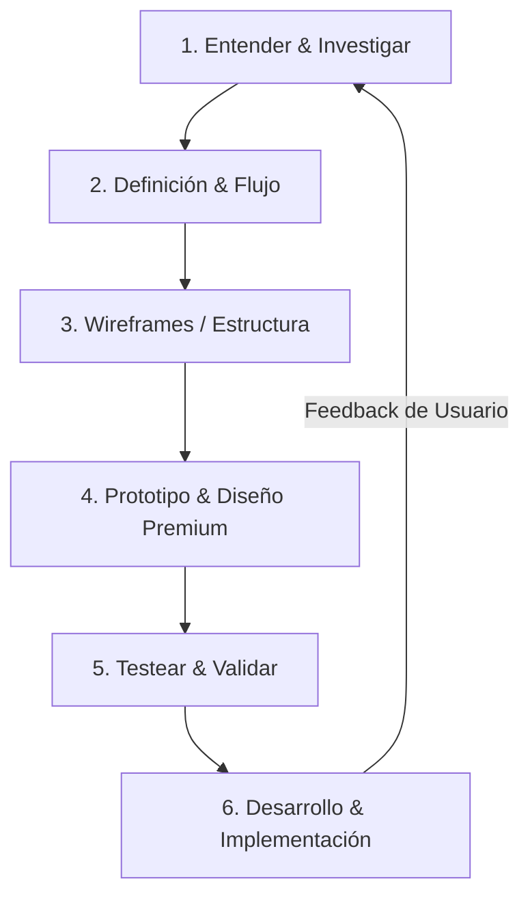

# El Proceso de Diseño UX/UI

Un gran software no se construye programando a ciegas. Esta guía define el proceso iterativo que debe seguirse para diseñar, prototipar, probar y refinar la experiencia de usuario antes, durante y después de escribir código de producción.

---



---

## Fase 1: Entender e Investigar (Research)

Antes de abrir Figma o escribir HTML, debes entender el contexto y las necesidades reales del usuario.

### Acciones del Agente/Diseñador:
1. **Definir el problema:** ¿Qué dolor tiene el usuario y por qué la solución actual no sirve?
2. **Entrevistas y Observación:** Si es posible, observa cómo trabaja el usuario actualmente (incluso si es con Excel o lápiz y papel).
3. **Analizar la competencia (Benchmark):** Investiga soluciones existentes. ¿Qué hacen bien? ¿Qué hacen mal? ¿Cómo podemos diferenciarnos?

---

## Fase 2: Definición y Arquitectura de la Información

Define qué pantallas/páginas son necesarias y cómo se conectan entre sí.

### Entregables Clave:
- **User Personas:** Arquetipos de usuarios típicos (ej. "Administrador de RRHH", "Usuario Final Movil").
- **User Journey Map:** El camino paso a paso que realiza un usuario para lograr un objetivo (ej. Registrarse y subir un CV).
- **Mapa del Sitio / Flujograma:** Estructura jerárquica de la aplicación.
  
```
Inicio/Dashboard
 ├── Perfil de Usuario
 ├── Solicitudes
 │    ├── Nueva Solicitud (Flujo de 3 pasos)
 │    └── Historial de Solicitudes
 └── Configuración
```

---

## Fase 3: Wireframes (Estructura de Baja Fidelidad)

Los wireframes se enfocan en la disposición de los elementos y la jerarquía de la información, omitiendo colores, tipografía e imágenes.

### Reglas de Wireframing:
- **Enfoque en Funcionalidad:** Discute con el usuario si el botón debe ir arriba, a la izquierda, o si la información está agrupada lógicamente.
- **Rapidez:** Hazlo en papel o con herramientas rápidas (como Excalidraw o Figma en escala de grises). Es más barato tirar a la basura un boceto de 5 minutos que cambiar 1000 líneas de código React.
- **Validar con el Usuario:** Asegúrate de que el flujo lógico tiene sentido antes de pasar a la parte visual.

---

## Fase 4: Prototipo y Diseño de Alta Fidelidad (Premium UI)

Aquí se aplica la identidad de marca, la paleta de colores HSL refinada, la tipografía premium y los espaciados consistentes definidos en `docs/ux-design/index.md`.

### Pautas para el Diseño Premium:
1. **Uso de Sombras y Gradientes Sutiles:** La profundidad visual hace que la aplicación se sienta tridimensional y pulida.
2. **Imágenes y Recursos Reales:** No uses placeholders genéricos (`lorempixel.com`). Utiliza imágenes reales de alta calidad (Unsplash) o genera ilustraciones coherentes.
3. **Micro-animaciones Interactivas:**
   - **Hover:** Elevación de tarjetas, cambio de opacidad o color suave con transiciones (`transition: all 0.2s ease-in-out`).
   - **Feedback Activo:** Botones que se encogen ligeramente al hacer clic (`transform: scale(0.98)`).
   - **Cargas (Skeletons):** Fondos que parpadean suavemente simulando la forma del contenido real en camino.
   - **Transición de Pantallas:** Entradas de componentes suaves (fading y sliding hacia arriba).

---

## Fase 5: Pruebas y Validación (Testing)

Prueba el diseño final de alta fidelidad o el prototipo interactivo con usuarios reales.

### Métodos de Pruebas Rápidas:
- **Prueba del Pasillo (Guerrilla Testing):** Pídele a alguien que no conozca el proyecto que intente completar una tarea básica (ej. "Intenta cambiar tu contraseña"). Observa dónde hace clic o dónde se confunde.
- **Think Aloud (Pensar en voz alta):** Pide al usuario que exprese verbalmente lo que está pensando y sintiendo mientras interactúa con la pantalla.
- **Grabar la Sesión:** Usa grabaciones (o herramientas como Hotjar) para identificar dónde se detiene el puntero o qué campos de formulario causan frustración.

---

## Fase 6: Desarrollo e Iteración Continua

Cuando el diseño es aprobado, el desarrollador (o el agente de codificación) lo traduce a código estructurado.

### Ciclo de Feedback en Producción:
- **Analítica Web:** Mide qué botones se usan y cuáles no.
- **Hotjar / Clarity:** Revisa mapas de calor de clics y scrolls.
- **Canales de Feedback:** Integra un pequeño botón o popup para reportar bugs o sugerir mejoras en un solo clic.
